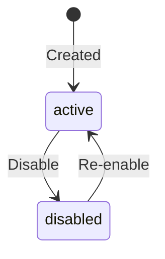

## What Is a Payment Method?

A payment method is the primary way you configure how you receive crypto payments on billing.io. It combines four things into a single, manageable resource:

1. **Chain** -- which blockchain network (Tron, Arbitrum, or Base)
2. **Token** -- which stablecoin (USDT or USDC)
3. **Wallet** -- which receiving address on that chain
4. **Rules** -- confirmation requirements, amount limits, and display settings

When a customer pays you, the payment method determines where their funds go and what validation rules apply.

<Tip>
  If you are coming from traditional payment processing, think of a payment method like a "bank account + processing rules" bundle.
  Instead of a bank account number, you have a blockchain wallet. Instead of card network rules, you have confirmation thresholds and amount limits.
</Tip>

## Wallets vs. Payment Methods

billing.io separates the concept of **wallets** (low-level plumbing) from **payment methods** (user-facing configuration).

| Concept | Purpose | Scope |
|---------|---------|-------|
| **Wallet** | A blockchain address you own | Internal plumbing -- you register it once |
| **Payment Method** | A configured receiving rail | Customer-facing -- defines how payments are processed |

A single wallet can back multiple payment methods. For example, if you have one Tron wallet, you could create two payment methods from it: one for USDT with a $10 minimum, and another for USDC with no minimum.

```
Wallet (Tron address: TXyz...)
  |
  +-- Payment Method: "USDT Payments" (chain: tron, token: USDT, min: $10)
  +-- Payment Method: "USDC Payments" (chain: tron, token: USDC, min: $0)
```

<Note>
  You manage wallets under **Settings > Wallets** in the dashboard. Payment methods are managed under
  **Payments > Payment Methods**. Wallets are the plumbing; payment methods are what your customers interact with.
</Note>

## Configuration Options

Each payment method has the following configuration:

| Field | Type | Description |
|-------|------|-------------|
| `chain` | string | Blockchain network: `tron`, `arbitrum`, or `base` |
| `token` | string | Stablecoin: `USDT` or `USDC` |
| `wallet_id` | string | Reference to your registered wallet on that chain |
| `display_name` | string | Human-readable label (e.g., "Primary USDT on Tron") |
| `required_confirmations` | integer | Number of block confirmations before payment is final |
| `min_amount_usd` | number | Minimum payment amount in USD (optional) |
| `max_amount_usd` | number | Maximum payment amount in USD (optional) |
| `is_default` | boolean | Whether this is the default payment method |
| `status` | string | `active` or `disabled` |

<Warning>
  The `required_confirmations` field has sensible defaults per chain (Tron: 20, Arbitrum: 12, Base: 12).
  Lowering this value increases the risk of accepting payments from transactions that could be reversed.
  Only change this if you understand the security implications.
</Warning>

## Default Payment Method

You can designate one payment method as your **default**. The default payment method is used when:

- A checkout is created without specifying a `payment_method_id`
- A payment link does not have a payment method assigned
- A subscription plan does not specify a payment method

Only one payment method can be the default at a time. Setting a new default automatically unsets the previous one.

## Status Lifecycle

Payment methods have a simple two-state lifecycle:



| Status | Behavior |
|--------|----------|
| `active` | Available for new checkouts and subscriptions |
| `disabled` | Cannot be used for new checkouts. Existing in-progress checkouts continue to settle normally. |

<Info>
  Disabling a payment method does not affect in-flight payments. Any checkout that is already
  `pending`, `detected`, or `confirming` will continue through to completion.
</Info>

## Code Examples

### Create a Payment Method

<CodeGroup>
```bash curl
curl -X POST https://api.billing.io/api/payment-methods \
  -H "Authorization: Bearer YOUR_API_KEY" \
  -H "Content-Type: application/json" \
  -d '{
    "chain": "tron",
    "token": "USDT",
    "wallet_id": "wal_abc123",
    "display_name": "Primary USDT on Tron",
    "required_confirmations": 20,
    "min_amount_usd": 5.00,
    "max_amount_usd": 10000.00,
    "is_default": true
  }'
```

```javascript node.js
const response = await fetch("https://api.billing.io/api/payment-methods", {
  method: "POST",
  headers: {
    Authorization: "Bearer YOUR_API_KEY",
    "Content-Type": "application/json",
  },
  body: JSON.stringify({
    chain: "tron",
    token: "USDT",
    wallet_id: "wal_abc123",
    display_name: "Primary USDT on Tron",
    required_confirmations: 20,
    min_amount_usd: 5.0,
    max_amount_usd: 10000.0,
    is_default: true,
  }),
});

const paymentMethod = await response.json();
console.log(paymentMethod.id); // pm_a1b2c3d4e5f6...
```
</CodeGroup>

### List Payment Methods

<CodeGroup>
```bash curl
curl https://api.billing.io/api/payment-methods \
  -H "Authorization: Bearer YOUR_API_KEY"
```

```javascript node.js
const response = await fetch("https://api.billing.io/api/payment-methods", {
  headers: {
    Authorization: "Bearer YOUR_API_KEY",
  },
});

const { data } = await response.json();
// data: [{ id: "pm_...", chain: "tron", token: "USDT", ... }]
```
</CodeGroup>

### Set as Default

<CodeGroup>
```bash curl
curl -X POST https://api.billing.io/api/payment-methods/pm_a1b2c3d4e5f6/default \
  -H "Authorization: Bearer YOUR_API_KEY"
```

```javascript node.js
const response = await fetch(
  "https://api.billing.io/api/payment-methods/pm_a1b2c3d4e5f6/default",
  {
    method: "POST",
    headers: {
      Authorization: "Bearer YOUR_API_KEY",
    },
  }
);
```
</CodeGroup>

### Disable a Payment Method

<CodeGroup>
```bash curl
curl -X PATCH https://api.billing.io/api/payment-methods/pm_a1b2c3d4e5f6 \
  -H "Authorization: Bearer YOUR_API_KEY" \
  -H "Content-Type: application/json" \
  -d '{ "status": "disabled" }'
```

```javascript node.js
const response = await fetch(
  "https://api.billing.io/api/payment-methods/pm_a1b2c3d4e5f6",
  {
    method: "PATCH",
    headers: {
      Authorization: "Bearer YOUR_API_KEY",
      "Content-Type": "application/json",
    },
    body: JSON.stringify({ status: "disabled" }),
  }
);
```
</CodeGroup>

## Best Practices

<CardGroup cols={2}>
  <Card title="One method per chain-token pair" icon="layer-group">
    For most setups, create one payment method per chain and token combination.
    This keeps your configuration clean and your reporting straightforward.
  </Card>
  <Card title="Set amount limits" icon="shield">
    Use `min_amount_usd` to avoid dust payments and `max_amount_usd` to limit
    exposure per transaction. You can always adjust these later.
  </Card>
  <Card title="Always have a default" icon="star">
    Ensure you have a default payment method set. This prevents errors when
    checkouts or subscriptions are created without specifying one explicitly.
  </Card>
  <Card title="Use display names" icon="tag">
    Give each payment method a clear `display_name` so your team can easily
    identify them in the dashboard (e.g., "USDT on Tron - Main" vs "USDC on Base - Testing").
  </Card>
</CardGroup>
