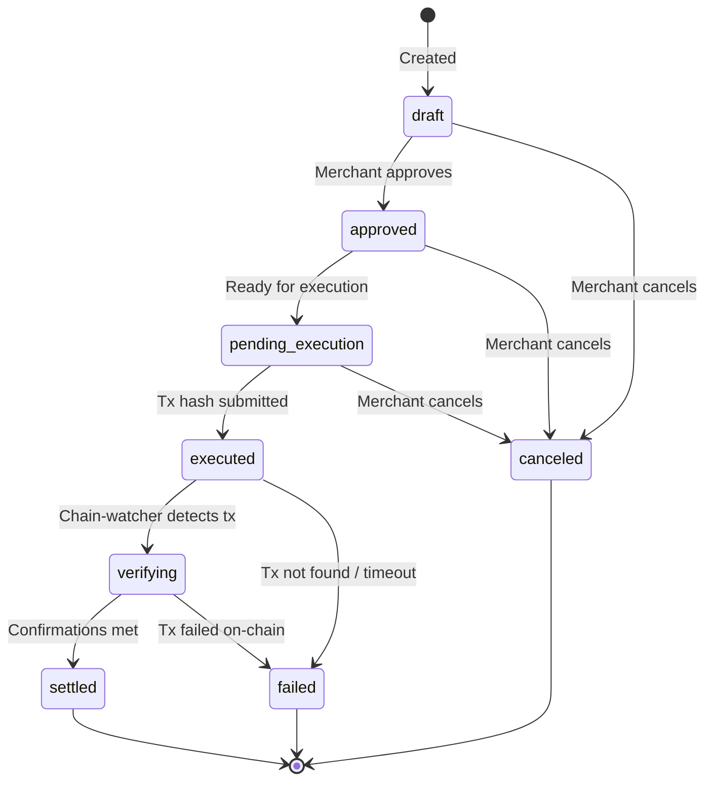

billing.io payouts are an orchestration layer for your outbound payments. You execute the on-chain transaction from your own wallet — billing.io tracks intent, verifies settlement, and reconciles.

billing.io never moves crypto on your behalf. This preserves the [non-custodial model](/what-is-non-custodial) while giving you full reconciliation and audit capabilities.

<Note>
  Payout orchestration requires the **Scale** plan or above.
</Note>

---

## How it works

1. **Create** a payout intent describing what you plan to send
2. **Approve** the intent (review workflow)
3. **Execute** the transfer from your wallet using any tool you prefer
4. **Submit** the transaction hash to billing.io
5. **billing.io verifies** the transaction on-chain via the chain-watcher
6. **Settlement recorded** — reconciliation entry created automatically

---

## Payout intent lifecycle



<AccordionGroup>
  <Accordion title="draft">
    Created but not yet approved. Use this state to queue payouts for review.
  </Accordion>
  <Accordion title="approved">
    Reviewed and approved. Ready for on-chain execution.
  </Accordion>
  <Accordion title="executed">
    Transaction hash submitted. Chain-watcher begins monitoring.
  </Accordion>
  <Accordion title="verifying">
    Transaction detected on-chain. Waiting for required block confirmations.
  </Accordion>
  <Accordion title="settled">
    Confirmed on-chain with sufficient confirmations. Settlement record created.
  </Accordion>
  <Accordion title="failed">
    Transaction failed, was not found, or was reverted. Create a new intent to retry.
  </Accordion>
  <Accordion title="canceled">
    Canceled before execution. No on-chain activity occurred.
  </Accordion>
</AccordionGroup>

---

## Settlement verification

After a transaction hash is submitted, the chain-watcher automatically:

<Steps>
  <Step title="Detects the transaction">
    Monitors the blockchain for the submitted hash. Payout moves to `verifying`.
  </Step>
  <Step title="Counts confirmations">
    Tracks block confirmations until the required threshold is met.
  </Step>
  <Step title="Creates settlement record">
    Records block number, confirmation count, atomic amount, and timestamps.
  </Step>
  <Step title="Updates payout intent">
    Status moves to `settled`. A revenue event is created for the settlement.
  </Step>
</Steps>

---

## Reconciliation

Reconciliation matches payout intents to their on-chain settlements. billing.io reconciles automatically, and provides a view for auditing.

| Category | Description |
|----------|-------------|
| **Matched** | Intent has a corresponding settlement with matching amount and recipient |
| **Unmatched** | Intent exists but no settlement recorded yet |
| **Discrepancy** | Settlement exists but amount or details do not match the original intent |

<Info>
  Discrepancies can occur due to token transfer fees on certain chains. Review discrepancies
  in the dashboard under **Payouts > Reconciliation**.
</Info>

---

## Code examples

See the [Payout Orchestration guide](/guides/payout-orchestration) for complete step-by-step implementation with code in cURL, Node.js, and Python.

### Create a payout intent

<CodeGroup>
```bash curl
curl -X POST https://api.billing.io/v1/payouts \
  -H "Authorization: Bearer YOUR_API_KEY" \
  -H "Content-Type: application/json" \
  -d '{
    "recipient_address": "TXyz1234567890abcdef",
    "chain": "tron",
    "token": "USDT",
    "amount": 500.00,
    "currency": "USD",
    "reference_type": "invoice",
    "reference_id": "inv_abc123"
  }'
```

```javascript node.js
const response = await fetch("https://api.billing.io/v1/payouts", {
  method: "POST",
  headers: {
    Authorization: "Bearer YOUR_API_KEY",
    "Content-Type": "application/json",
  },
  body: JSON.stringify({
    recipient_address: "TXyz1234567890abcdef",
    chain: "tron",
    token: "USDT",
    amount: 500.0,
    currency: "USD",
    reference_type: "invoice",
    reference_id: "inv_abc123",
  }),
});

const payoutIntent = await response.json();
console.log(payoutIntent.id); // po_a1b2c3d4e5f6...
console.log(payoutIntent.status); // "draft"
```
</CodeGroup>

<Tip>
  For high-volume operations, create payout intents in bulk via the API and
  batch your on-chain transactions. Submit each tx hash individually to maintain
  a clean 1:1 mapping between intents and settlements.
</Tip>
