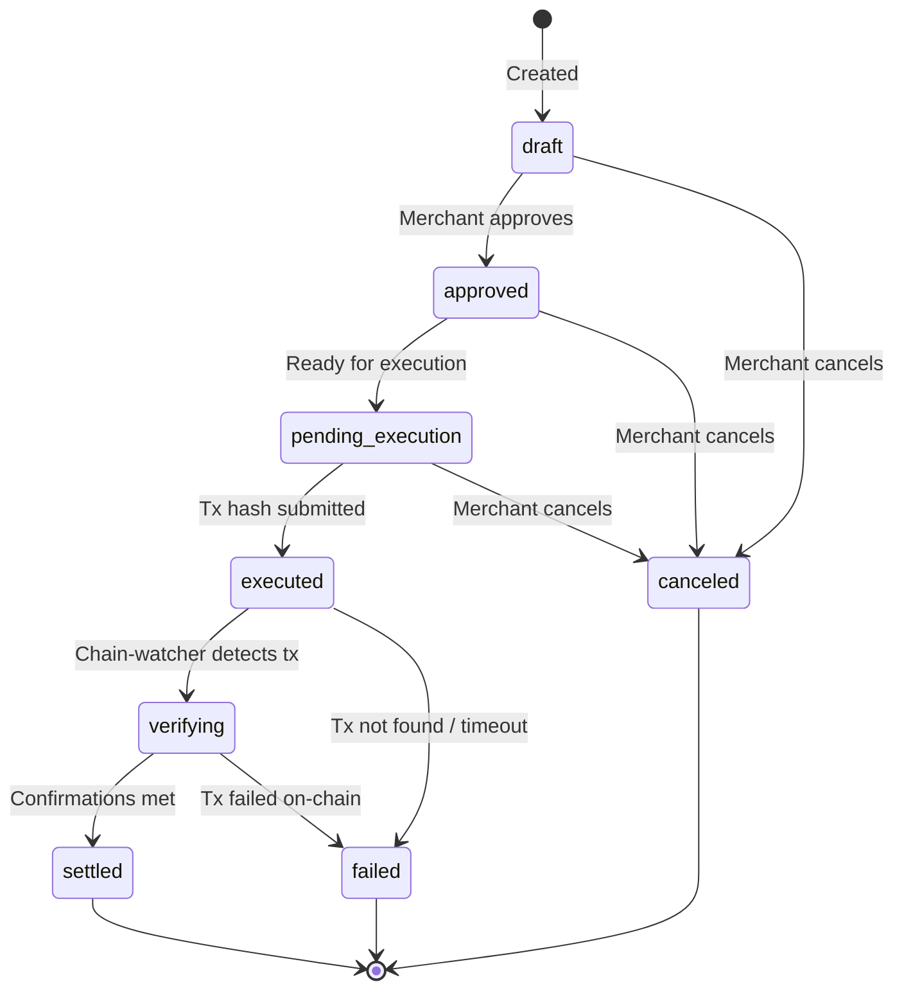

## Non-Custodial Payout Model

billing.io payouts are fundamentally different from traditional payment processors. Since billing.io never holds your funds, the payout flow is an orchestration process, not a funds transfer.

Here is how it works:

1. **You define the intent** -- billing.io records what should be paid, to whom, and on which chain
2. **You execute externally** -- you send the transaction from your own wallet using any tool you prefer
3. **You submit the tx hash** -- billing.io records the transaction reference
4. **Chain-watcher verifies** -- billing.io monitors the blockchain to confirm settlement
5. **Reconciliation runs** -- billing.io matches the settlement to the original intent

<Note>
  billing.io never moves crypto on your behalf. Payout intents are a bookkeeping and verification layer
  on top of transactions you execute yourself. This preserves the non-custodial model while giving you
  full reconciliation and audit capabilities.
</Note>

## Payout Intent Lifecycle

Payout intents move through a finite state machine with eight possible states:



<AccordionGroup>
  <Accordion title="draft">
    The payout intent has been created but not yet approved. Use this state to queue up payouts
    for review before committing to execution.
  </Accordion>
  <Accordion title="approved">
    The payout intent has been reviewed and approved. It is ready for the merchant to execute
    the on-chain transaction.
  </Accordion>
  <Accordion title="pending_execution">
    The payout intent is awaiting the merchant to submit a transaction hash after executing
    the payout from their wallet.
  </Accordion>
  <Accordion title="executed">
    A transaction hash has been submitted. The chain-watcher will begin monitoring
    the blockchain for the transaction.
  </Accordion>
  <Accordion title="verifying">
    The chain-watcher has detected the transaction on-chain and is waiting for the required
    number of block confirmations.
  </Accordion>
  <Accordion title="settled">
    The transaction has been confirmed on-chain with sufficient block confirmations.
    A settlement record has been created and linked to this payout intent.
  </Accordion>
  <Accordion title="failed">
    The transaction failed on-chain, was not found within the expected timeframe, or
    was reverted. The payout intent cannot be retried -- create a new one instead.
  </Accordion>
  <Accordion title="canceled">
    The payout intent was canceled by the merchant before execution. No on-chain
    activity occurred.
  </Accordion>
</AccordionGroup>

## Settlement Verification

When a payout is executed and the tx hash is submitted, the chain-watcher takes over:

<Steps>
  <Step title="Transaction Detection">
    The chain-watcher monitors the blockchain for the submitted transaction hash. Once the transaction
    appears in a block, the payout intent moves to `verifying`.
  </Step>
  <Step title="Confirmation Tracking">
    The chain-watcher counts block confirmations as new blocks are added to the chain. Each chain
    has a required confirmation threshold before the settlement is considered final.
  </Step>
  <Step title="Settlement Record Created">
    Once the confirmation threshold is met, the chain-watcher calls billing.io's internal endpoint
    to create a settlement record. This record includes the block number, confirmation count,
    atomic amount, and timestamps.
  </Step>
  <Step title="Payout Intent Updated">
    The payout intent status moves to `settled`, and the `verified_at` timestamp is set.
    A revenue event is also created for the settlement.
  </Step>
</Steps>

### Required Confirmations by Chain

| Chain | Required Confirmations | Approximate Time |
|-------|----------------------|-----------------|
| Tron | 20 blocks | ~60 seconds |
| Arbitrum | 12 blocks | ~3 seconds |
| Base | 12 blocks | ~24 seconds |

<Warning>
  These confirmation thresholds are enforced by the chain-watcher and cannot be lowered
  for payout settlements. They are set to provide a high degree of finality assurance.
</Warning>

## Reconciliation

Reconciliation is the process of matching payout intents to their on-chain settlements. billing.io automatically reconciles when settlements are verified, but also provides a reconciliation view for auditing.

The reconciliation endpoint returns three categories:

| Category | Description |
|----------|-------------|
| **Matched** | Payout intent has a corresponding settlement with matching amount and recipient |
| **Unmatched** | Payout intent exists but no settlement has been recorded yet |
| **Discrepancy** | Settlement exists but the amount or details do not match the original intent |

<Info>
  Discrepancies can occur if the executed transaction amount differs from the payout intent amount
  (e.g., due to token transfer fees on certain chains). Review discrepancies in the dashboard
  under **Payouts > Reconciliation**.
</Info>

## Settlement Record

Each verified settlement creates a record with the following details:

| Field | Description |
|-------|-------------|
| `id` | Settlement ID (prefixed `stl_`) |
| `payout_intent_id` | The payout intent this settlement verifies |
| `tx_hash` | On-chain transaction hash |
| `block_number` | Block in which the transaction was included |
| `confirmations` | Number of confirmations at time of verification |
| `amount_atomic` | Transaction amount in the token's smallest unit |
| `chain` | Blockchain network |
| `detected_at` | When the chain-watcher first saw the transaction |
| `confirmed_at` | When the required confirmations were reached |

## Code Examples

### Create a Payout Intent

<CodeGroup>
```bash curl
curl -X POST https://api.billing.io/api/payouts \
  -H "Authorization: Bearer YOUR_API_KEY" \
  -H "Content-Type: application/json" \
  -d '{
    "recipient_address": "TXyz1234567890abcdef",
    "chain": "tron",
    "token": "USDT",
    "amount": 500.00,
    "currency": "USD",
    "reference_type": "invoice",
    "reference_id": "inv_abc123",
    "due_date": "2025-02-15T00:00:00Z"
  }'
```

```javascript node.js
const response = await fetch("https://api.billing.io/api/payouts", {
  method: "POST",
  headers: {
    Authorization: "Bearer YOUR_API_KEY",
    "Content-Type": "application/json",
  },
  body: JSON.stringify({
    recipient_address: "TXyz1234567890abcdef",
    chain: "tron",
    token: "USDT",
    amount: 500.0,
    currency: "USD",
    reference_type: "invoice",
    reference_id: "inv_abc123",
    due_date: "2025-02-15T00:00:00Z",
  }),
});

const payoutIntent = await response.json();
console.log(payoutIntent.id); // po_a1b2c3d4e5f6...
console.log(payoutIntent.status); // "draft"
```
</CodeGroup>

### Approve a Payout Intent

<CodeGroup>
```bash curl
curl -X PATCH https://api.billing.io/api/payouts/po_a1b2c3d4e5f6 \
  -H "Authorization: Bearer YOUR_API_KEY" \
  -H "Content-Type: application/json" \
  -d '{ "action": "approve" }'
```

```javascript node.js
const response = await fetch(
  "https://api.billing.io/api/payouts/po_a1b2c3d4e5f6",
  {
    method: "PATCH",
    headers: {
      Authorization: "Bearer YOUR_API_KEY",
      "Content-Type": "application/json",
    },
    body: JSON.stringify({ action: "approve" }),
  }
);

const payoutIntent = await response.json();
console.log(payoutIntent.status); // "approved"
```
</CodeGroup>

### Submit Transaction Hash

After executing the payout from your wallet, submit the transaction hash so the chain-watcher can verify it:

<CodeGroup>
```bash curl
curl -X POST https://api.billing.io/api/payouts/po_a1b2c3d4e5f6/execute \
  -H "Authorization: Bearer YOUR_API_KEY" \
  -H "Content-Type: application/json" \
  -d '{
    "tx_hash": "abc123def456789..."
  }'
```

```javascript node.js
const response = await fetch(
  "https://api.billing.io/api/payouts/po_a1b2c3d4e5f6/execute",
  {
    method: "POST",
    headers: {
      Authorization: "Bearer YOUR_API_KEY",
      "Content-Type": "application/json",
    },
    body: JSON.stringify({
      tx_hash: "abc123def456789...",
    }),
  }
);

const payoutIntent = await response.json();
console.log(payoutIntent.status); // "executed"
```
</CodeGroup>

### View Settlements

<CodeGroup>
```bash curl
curl "https://api.billing.io/api/payouts/settlements" \
  -H "Authorization: Bearer YOUR_API_KEY"
```

```javascript node.js
const response = await fetch("https://api.billing.io/api/payouts/settlements", {
  headers: {
    Authorization: "Bearer YOUR_API_KEY",
  },
});

const { data } = await response.json();
// data: [{ id: "stl_...", tx_hash: "...", confirmed_at: "...", ... }]
```
</CodeGroup>

### View Reconciliation

<CodeGroup>
```bash curl
curl "https://api.billing.io/api/payouts/reconciliation" \
  -H "Authorization: Bearer YOUR_API_KEY"
```

```javascript node.js
const response = await fetch(
  "https://api.billing.io/api/payouts/reconciliation",
  {
    headers: {
      Authorization: "Bearer YOUR_API_KEY",
    },
  }
);

const reconciliation = await response.json();
// {
//   matched: [...],
//   unmatched: [...],
//   discrepancies: [...]
// }
```
</CodeGroup>

## Typical Payout Workflow

<Steps>
  <Step title="Create payout intents">
    Create one or more payout intents for the amounts you need to pay out.
    These start in `draft` status.
  </Step>
  <Step title="Review and approve">
    Review the payout intents in your dashboard or via API. Approve each one
    to signal that it is ready for execution.
  </Step>
  <Step title="Execute from your wallet">
    Send the crypto transaction from your wallet using your preferred tool
    (hardware wallet, multisig, exchange, etc.).
  </Step>
  <Step title="Submit the tx hash">
    Call the execute endpoint with the transaction hash. The chain-watcher
    begins monitoring for on-chain confirmation.
  </Step>
  <Step title="Automatic settlement">
    The chain-watcher verifies the transaction and creates a settlement record
    once the required confirmations are reached. No further action needed.
  </Step>
  <Step title="Reconcile">
    Check the reconciliation view to confirm all payout intents have been
    settled and there are no discrepancies.
  </Step>
</Steps>

<Tip>
  For high-volume operations, create payout intents in bulk via the API and
  batch your on-chain transactions. Submit each tx hash individually to maintain
  a clean 1:1 mapping between intents and settlements.
</Tip>
