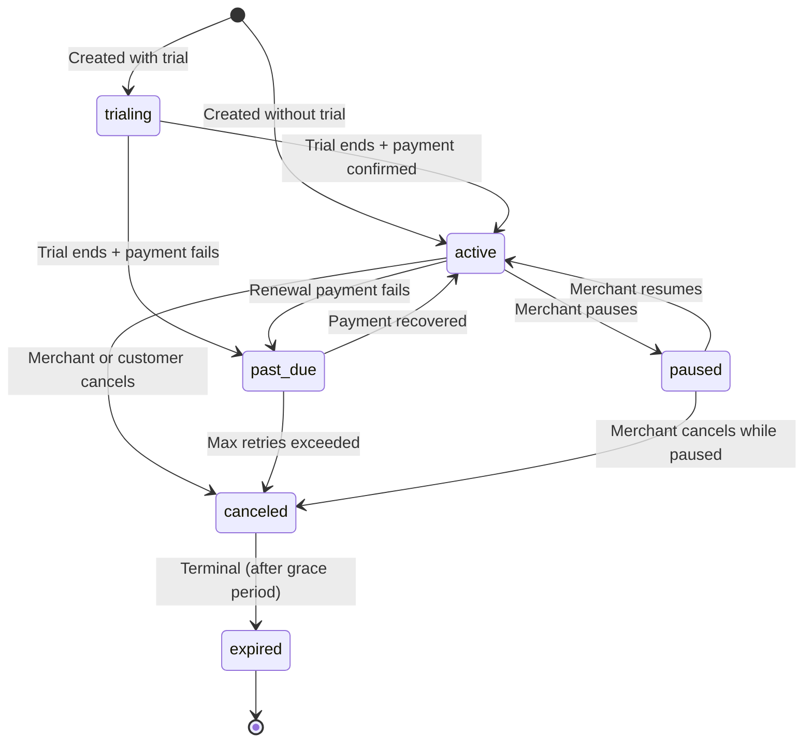

billing.io handles recurring billing through **plans**, **subscriptions**, and automated **renewal checkouts**. Payments are collected in crypto at each billing interval.

billing.io manages the full lifecycle — trials, renewals, retries, pauses, cancellations — so you can focus on your product.

<Info>
  Subscription billing requires the **Growth** plan or above. You need at least one active
  [payment method](/concepts/payment-methods) configured before creating subscriptions.
</Info>

---

## Core concepts

| Concept | Description |
|---------|-------------|
| **Plan** | Defines billing terms: price, interval, token, chain, and optional trial period |
| **Subscription** | Links a customer to a plan. Tracks status and billing periods. |
| **Renewal** | Created automatically at each billing interval. Generates a checkout for payment. |
| **Entitlement** | Feature flags attached to plans for gating access in your application. |

---

## Subscription lifecycle

Subscriptions move through a defined state machine:



| Status | Description |
|--------|-------------|
| `trialing` | Trial period active. No payment collected yet. |
| `active` | Current period is paid. Access should be granted. |
| `past_due` | Payment failed after retries. Customer should be notified. |
| `paused` | Paused by merchant. Renewals skipped until resumed. |
| `canceled` | Canceled. Access continues until `current_period_end`. |
| `expired` | Terminal. Subscription has ended. |

---

## Renewal flow

When a billing period ends, billing.io automatically:

1. Creates a **renewal record** (status: `pending`)
2. Generates a **checkout** for the next payment
3. Waits for the customer to pay

If the checkout is confirmed, the renewal is marked `paid` and the subscription period advances. If payment fails, billing.io retries up to `max_attempts`. After all retries are exhausted, the subscription moves to `past_due`.

---

## Entitlements

Entitlements attach feature flags to plans. Use them to gate features based on which plan a customer is subscribed to.

| Value Type | Field | Example |
|-----------|-------|---------|
| `boolean` | `value_boolean` | `advanced_analytics: true` |
| `numeric` | `value_numeric` | `api_requests: 10000` |
| `string` | `value_string` | `support_level: "priority"` |

Check entitlements at runtime via `GET /subscriptions/entitlements/check`.

<Tip>
  Entitlements are defined on the **plan**, not on individual subscriptions.
  Updating entitlements on a plan affects all active subscribers immediately.
</Tip>

---

## Plan intervals

| Interval | Description |
|----------|-------------|
| `daily` | Billed every day |
| `weekly` | Billed every 7 days |
| `monthly` | Billed every calendar month |
| `yearly` | Billed every calendar year |

---

## Key webhook events

| Event | Recommended Action |
|-------|--------------------|
| `subscription.renewed` | Extend access for the new period |
| `subscription.past_due` | Warn the customer, offer retry |
| `subscription.paused` | Restrict feature access |
| `subscription.canceled` | Revoke access at period end |

---

## Code examples

### Create a plan

<CodeGroup>
```bash curl
curl -X POST https://api.billing.io/v1/subscriptions/plans \
  -H "Authorization: Bearer YOUR_API_KEY" \
  -H "Content-Type: application/json" \
  -d '{
    "name": "Pro Monthly",
    "amount_usd": 49.99,
    "interval": "monthly",
    "token": "USDT",
    "chain": "tron",
    "trial_days": 14
  }'
```

```javascript node.js
const response = await fetch("https://api.billing.io/v1/subscriptions/plans", {
  method: "POST",
  headers: {
    Authorization: "Bearer YOUR_API_KEY",
    "Content-Type": "application/json",
  },
  body: JSON.stringify({
    name: "Pro Monthly",
    amount_usd: 49.99,
    interval: "monthly",
    token: "USDT",
    chain: "tron",
    trial_days: 14,
  }),
});

const plan = await response.json();
console.log(plan.id); // plan_a1b2c3d4e5f6...
```
</CodeGroup>

### Create a subscription

<CodeGroup>
```bash curl
curl -X POST https://api.billing.io/v1/subscriptions \
  -H "Authorization: Bearer YOUR_API_KEY" \
  -H "Content-Type: application/json" \
  -d '{
    "customer_id": "cus_abc123def456",
    "plan_id": "plan_xyz789",
    "payment_method_id": "pm_a1b2c3d4e5f6"
  }'
```

```javascript node.js
const response = await fetch("https://api.billing.io/v1/subscriptions", {
  method: "POST",
  headers: {
    Authorization: "Bearer YOUR_API_KEY",
    "Content-Type": "application/json",
  },
  body: JSON.stringify({
    customer_id: "cus_abc123def456",
    plan_id: "plan_xyz789",
    payment_method_id: "pm_a1b2c3d4e5f6",
  }),
});

const subscription = await response.json();
console.log(subscription.id); // sub_a1b2c3d4e5f6...
console.log(subscription.status); // "trialing" or "active"
```
</CodeGroup>

### Pause, resume, and cancel

<AccordionGroup>
  <Accordion title="Pause a subscription">
    ```bash
    curl -X PATCH https://api.billing.io/v1/subscriptions/sub_abc123 \
      -H "Authorization: Bearer YOUR_API_KEY" \
      -H "Content-Type: application/json" \
      -d '{ "action": "pause" }'
    ```
  </Accordion>
  <Accordion title="Resume a subscription">
    ```bash
    curl -X PATCH https://api.billing.io/v1/subscriptions/sub_abc123 \
      -H "Authorization: Bearer YOUR_API_KEY" \
      -H "Content-Type: application/json" \
      -d '{ "action": "resume" }'
    ```
  </Accordion>
  <Accordion title="Cancel a subscription">
    ```bash
    curl -X PATCH https://api.billing.io/v1/subscriptions/sub_abc123 \
      -H "Authorization: Bearer YOUR_API_KEY" \
      -H "Content-Type: application/json" \
      -d '{ "action": "cancel" }'
    ```
  </Accordion>
</AccordionGroup>

See the [Subscription Billing guide](/guides/subscription-billing) for the full implementation walkthrough.
