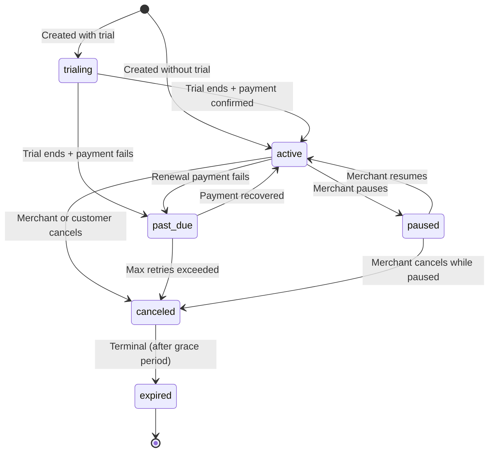

## Overview

billing.io subscriptions let you bill your customers on a recurring basis using crypto. The model is built around three core resources:

| Resource | Purpose | ID Prefix |
|----------|---------|-----------|
| **Plan** | Defines the terms -- amount, interval, token, trial period | `plan_` |
| **Subscription** | Tracks a customer's relationship to a plan over time | `sub_` |
| **Renewal** | Represents a single billing period attempt | `ren_` |

```
Plan (amount, interval, token)
  |
  +-- Subscription (customer + plan + payment method)
        |
        +-- Renewal (period 1) --> Checkout --> Confirmed
        +-- Renewal (period 2) --> Checkout --> Confirmed
        +-- Renewal (period 3) --> Checkout --> Pending...
```

<Note>
  Subscriptions in billing.io are for **your customers** (the people paying you), not for your
  billing.io platform plan. Your own billing.io subscription is managed separately via Stripe
  under **Plans & Usage**.
</Note>

## Subscription Lifecycle

Subscriptions move through a finite state machine with six states:



<AccordionGroup>
  <Accordion title="trialing">
    The subscription has an active trial period. No payments are collected. The customer has full
    access to plan entitlements. When the trial ends, the system creates a renewal and checkout
    for the first payment.
  </Accordion>
  <Accordion title="active">
    The subscription is in good standing. Renewal payments are being collected successfully.
    The subscription period advances automatically after each confirmed payment.
  </Accordion>
  <Accordion title="past_due">
    A renewal payment has failed or is overdue. The system retries the payment. The customer
    may still have access depending on your grace period configuration. If payment is not
    recovered, the subscription moves to `canceled`.
  </Accordion>
  <Accordion title="paused">
    The merchant has paused the subscription. No renewals are created and no payments are collected.
    The subscription can be resumed at any time, which returns it to `active` and starts a new period.
  </Accordion>
  <Accordion title="canceled">
    The subscription has been canceled -- either by the merchant, by the customer, or automatically
    after failed retry attempts. No further renewals are created.
  </Accordion>
  <Accordion title="expired">
    Terminal state. The subscription has fully expired after cancellation and any remaining grace period.
    This is the final state -- the subscription cannot be reactivated.
  </Accordion>
</AccordionGroup>

## How Renewals Work

Each billing period generates a renewal record that drives the payment collection process:

<Steps>
  <Step title="Renewal Created">
    The system creates a renewal record with the due date, amount, and a `pending` status.
  </Step>
  <Step title="Checkout Generated">
    A checkout is automatically created for the renewal amount, linked to the subscription's
    payment method. Status moves to `checkout_created`.
  </Step>
  <Step title="Customer Pays">
    The customer sends crypto to the wallet address specified in the checkout.
    The chain-watcher detects the transaction.
  </Step>
  <Step title="Confirmation">
    The chain-watcher monitors block confirmations. Once the required threshold is met,
    it calls billing.io's internal endpoint to confirm the payment.
  </Step>
  <Step title="Period Advances">
    The renewal is marked `paid`, the subscription period advances to the next cycle,
    and a revenue event is created for the confirmed payment.
  </Step>
</Steps>

**Renewal statuses:**

| Status | Description |
|--------|-------------|
| `pending` | Renewal created, awaiting checkout generation |
| `checkout_created` | Checkout generated, awaiting customer payment |
| `paid` | Payment confirmed on-chain, period advanced |
| `failed` | Payment failed after retry attempts |
| `skipped` | Renewal skipped (e.g., during pause or plan change) |

## Entitlements

Entitlements let you define feature flags and limits per subscription plan. When a customer subscribes to a plan, they inherit its entitlements. You can check these entitlements at runtime to gate features in your application.

Each entitlement has a `feature_key` and a typed value:

| Value Type | Use Case | Example |
|------------|----------|---------|
| `boolean` | Feature gates | `can_export_csv: true` |
| `numeric` | Usage limits | `max_api_calls: 10000` |
| `string` | Tier labels or config | `support_level: "priority"` |

<Tip>
  Entitlements are defined on the **plan**, not on individual subscriptions.
  When you update entitlements on a plan, all active subscribers to that plan
  are affected immediately.
</Tip>

## Trial Periods

Plans can include a trial period specified in days via the `trial_days` field. When a subscription is created for a plan with a trial:

1. The subscription starts in `trialing` status
2. `trial_end` is set to `created_at + trial_days`
3. No payment is collected during the trial
4. When the trial ends, a renewal and checkout are created for the first payment
5. If the first payment succeeds, the subscription moves to `active`
6. If the first payment fails, the subscription moves to `past_due`

## Pause, Resume, and Cancel

<AccordionGroup>
  <Accordion title="Pause">
    Pausing a subscription stops renewals from being created. The subscription status changes to `paused`.
    Use this when a customer wants to temporarily stop their subscription without losing their history.

    ```bash
    curl -X PATCH https://api.billing.io/api/subscriptions/sub_abc123 \
      -H "Authorization: Bearer YOUR_API_KEY" \
      -H "Content-Type: application/json" \
      -d '{ "action": "pause" }'
    ```
  </Accordion>
  <Accordion title="Resume">
    Resuming a paused subscription sets the status back to `active` and starts a new billing period
    from the current date. The previous period is not retroactively charged.

    ```bash
    curl -X PATCH https://api.billing.io/api/subscriptions/sub_abc123 \
      -H "Authorization: Bearer YOUR_API_KEY" \
      -H "Content-Type: application/json" \
      -d '{ "action": "resume" }'
    ```
  </Accordion>
  <Accordion title="Cancel">
    Canceling a subscription stops all future renewals. The subscription moves to `canceled` and eventually to `expired`.

    ```bash
    curl -X PATCH https://api.billing.io/api/subscriptions/sub_abc123 \
      -H "Authorization: Bearer YOUR_API_KEY" \
      -H "Content-Type: application/json" \
      -d '{ "action": "cancel" }'
    ```
  </Accordion>
</AccordionGroup>

## Code Examples

### Create a Plan

<CodeGroup>
```bash curl
curl -X POST https://api.billing.io/api/subscriptions/plans \
  -H "Authorization: Bearer YOUR_API_KEY" \
  -H "Content-Type: application/json" \
  -d '{
    "name": "Pro Monthly",
    "description": "Full access to all features, billed monthly",
    "amount_usd": 49.99,
    "interval": "monthly",
    "token": "USDT",
    "chain": "tron",
    "trial_days": 14
  }'
```

```javascript node.js
const response = await fetch("https://api.billing.io/api/subscriptions/plans", {
  method: "POST",
  headers: {
    Authorization: "Bearer YOUR_API_KEY",
    "Content-Type": "application/json",
  },
  body: JSON.stringify({
    name: "Pro Monthly",
    description: "Full access to all features, billed monthly",
    amount_usd: 49.99,
    interval: "monthly",
    token: "USDT",
    chain: "tron",
    trial_days: 14,
  }),
});

const plan = await response.json();
console.log(plan.id); // plan_a1b2c3d4e5f6...
```
</CodeGroup>

### Create a Subscription

<CodeGroup>
```bash curl
curl -X POST https://api.billing.io/api/subscriptions \
  -H "Authorization: Bearer YOUR_API_KEY" \
  -H "Content-Type: application/json" \
  -d '{
    "customer_id": "cus_abc123def456",
    "plan_id": "plan_xyz789",
    "payment_method_id": "pm_a1b2c3d4e5f6"
  }'
```

```javascript node.js
const response = await fetch("https://api.billing.io/api/subscriptions", {
  method: "POST",
  headers: {
    Authorization: "Bearer YOUR_API_KEY",
    "Content-Type": "application/json",
  },
  body: JSON.stringify({
    customer_id: "cus_abc123def456",
    plan_id: "plan_xyz789",
    payment_method_id: "pm_a1b2c3d4e5f6",
  }),
});

const subscription = await response.json();
console.log(subscription.id); // sub_a1b2c3d4e5f6...
console.log(subscription.status); // "trialing" or "active"
```
</CodeGroup>

### Check an Entitlement

<CodeGroup>
```bash curl
curl "https://api.billing.io/api/subscriptions/entitlements/check?customer_id=cus_abc123&feature_key=can_export_csv" \
  -H "Authorization: Bearer YOUR_API_KEY"
```

```javascript node.js
const params = new URLSearchParams({
  customer_id: "cus_abc123",
  feature_key: "can_export_csv",
});

const response = await fetch(
  `https://api.billing.io/api/subscriptions/entitlements/check?${params}`,
  {
    headers: {
      Authorization: "Bearer YOUR_API_KEY",
    },
  }
);

const entitlement = await response.json();
// {
//   feature_key: "can_export_csv",
//   value_type: "boolean",
//   value: true,
//   plan_id: "plan_xyz789"
// }
```
</CodeGroup>

### Create an Entitlement

<CodeGroup>
```bash curl
curl -X POST https://api.billing.io/api/subscriptions/entitlements \
  -H "Authorization: Bearer YOUR_API_KEY" \
  -H "Content-Type: application/json" \
  -d '{
    "plan_id": "plan_xyz789",
    "feature_key": "max_api_calls",
    "value_type": "numeric",
    "value_numeric": 10000
  }'
```

```javascript node.js
const response = await fetch(
  "https://api.billing.io/api/subscriptions/entitlements",
  {
    method: "POST",
    headers: {
      Authorization: "Bearer YOUR_API_KEY",
      "Content-Type": "application/json",
    },
    body: JSON.stringify({
      plan_id: "plan_xyz789",
      feature_key: "max_api_calls",
      value_type: "numeric",
      value_numeric: 10000,
    }),
  }
);

const entitlement = await response.json();
console.log(entitlement.id); // ent_a1b2c3d4e5f6...
```
</CodeGroup>

## Plan Intervals

Plans support the following billing intervals:

| Interval | Description |
|----------|-------------|
| `daily` | Billed every day |
| `weekly` | Billed every 7 days |
| `monthly` | Billed every calendar month |
| `yearly` | Billed every calendar year |

<Info>
  The `monthly` interval advances by calendar month (e.g., January 15 to February 15).
  The `yearly` interval advances by calendar year (e.g., 2025-03-01 to 2026-03-01).
</Info>
